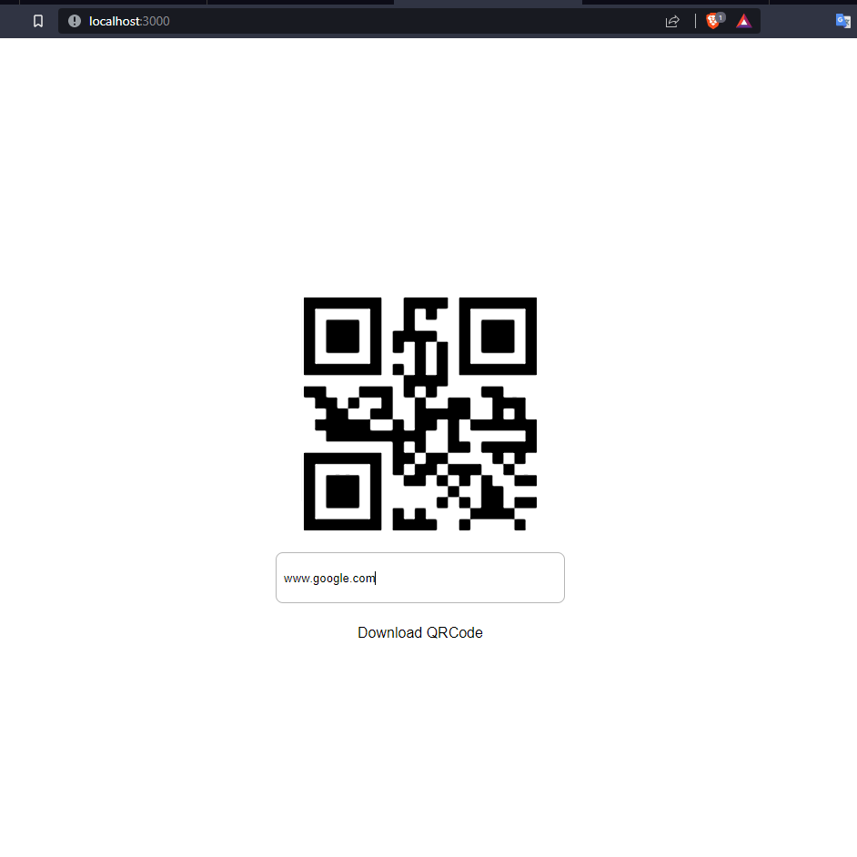

<h1 align="center"> Gerador de QRCode </h1>

##  Tecnologias

Esse projeto foi desenvolvido com as seguintes tecnologias:

- HTML e CSS
- JavaScript
- React JS

## Projeto

> Desenvolvido apartir dos etudos no Canal <a href="https://www.youtube.com/@Sujeitoprogramador" target=_blank>Sujeito programador</a>

- [Aula no Youtube](https://www.youtube.com/watch?v=cFaihdXLy5A)

## Layout

</a>